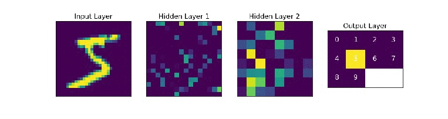

It is superfluous to state the impact deep (machine) learning has had on modern technology, as it powers many tools of modern society, ranging from web searches to content filtering on social networks. 
It is also increasingly present in consumer products such as  cameras, smartphones and automobiles. 

Machine-learning systems are used to identify objects in images, transcribe speech into text, match news items, and select relevant results of search. 

From a mathematical point of view however, a large number of the employed models and techniques remain rather ad hoc.

---
## I. Formulation

When formulated mathematically, deep supervised learning [1,3] roughly consists in solving an _optimal control problem_ for a nonlinear dynamical system, called an _artificial neural network_.

We are interested in approximating a function 

$$
f: \mathcal{X} \rightarrow \mathcal{Y}
$$ 
of some class, which is unknown a priori. 
We have data: its values (possibly noisy) at $S$ distinct points:
$$
\{\vec{x}_i, \vec{y}_i = f(\vec{x}_i) \}_{i=1}^S
$$
We generally split the _S_ data points into _N_ training  data, and _S-N-1_ test data.
In practice, _N_ is significantly bigger than _S-N-1_.

"Learning" generally consists in:
			
1. Proposing a candidate approximation 

	$$
    f_{w,b}(\cdot): \mathcal{X} \rightarrow \mathcal{Y}
    $$ 
    depending on tunable parameters _(w,b)_.
    A popular candidate for such a function is (a projecton of) the solution $z_i(1)$ of a _neural network_, which in the continuous-time context reads: 

$$
\begin{cases}
	\mathbf{x}_i'(t) &= \sigma(w(t)\mathbf{x}_i(t)+b(t)) \quad \text{ in } (0, 1) \\
	\mathbf{x}_i(0) &= \vec{x}_i \in \mathbf{R}^d.
\end{cases}
$$
2.  Tune _(w,b)_ as to minimize the empirical risk: 

$$
\sum_{i=1}^N loss(f_{w,b}(\vec{x}_i), \vec{y}_i), \quad \ell \geq 0, \,\ell(x, x) = 0.
$$ 

This is called _training_.
As generally _N_ is rather large, the minimizer is computed via an iterative method such as stochastic gradient descent (Robbins-Monro [7], Bottou et al [8]).

3. A posteriori analysis: check if test error 

$$
\sum_{i=N+1}^{S} loss(f_{w,b}(\vec{x}_i), \vec{y}_i)
$$ 

is small. 
When the a posteriori error (test error) is small, we refer to _generalization_.

In the above, $\sigma$ is a fixed, non-decreasing Lipschitz-continuous activation function.

- There are two types of tasks in supervised learning:
classification (labels take values in a discrete set), and regression (labels take continuous values).

- In practice, one generally considers the corresponding discretisation of the continuous-time dynamical system given above.

- The simplest forward Euler discretisation of the above system is called a _residual neural network_ (ResNet) with _L_ hidden layers:

$$
\begin{cases}
z_i^{k+1} = z_i^k + \sigma(A^k z_i^k + b^k) &\text{ for } k = 0, \ldots, L-1 \\
z_i^0 = \vec{x}_i \in \mathbf{R}^d.
\end{cases}
$$

------

## II. Optimal control

Summarizing the preceding discussion, in a variety of simple scenarios, deep learning may be formulated as a continuous-time optimal control problem:

$$

\inf_{u(t) \in U,\, (\alpha, \beta)} \sum_{i=1}^N |\vec{y}_i - \varphi(\alpha \, z(1)+\beta)|^2 + \frac{\epsilon}{2} \int_0^1 |(A(t), b(t))|^2 dt

$$
where $z = z_i$ solves

$$

\begin{cases}
	z'(t) &= \sigma(A(t)z(t)+b(t)) \quad \text{ in } (0, 1) \\
	z(0) &= \vec{x}_i \in \R^d.
\end{cases}

$$

The idea of viewing deep learning as finite dimensional optimal control is (mathematically) formulated in [12], and subsequently investigated from a theoretical and computational viewpoint in [5, 6, 7, 8], among others.

<!-- 

 <strong>Figure 4.</strong> 
The time-steps play the role of layers. We see that the points are linearly separable at the final time.

 <strong>Figure 5.</strong> 
Analogous scenario as in Figure 4, this time in dimension 3.

 -->

It is at the point of generalisation where the objective of supervised learning differs slightly from classical optimal control. 
Indeed, whilst in deep learning one too is interested in "matching" the labels of the training set, one also needs to guarantee satisfactory performance on points outside of the training set.

---
## III. References.

[1] Ian Goodfellow and Yoshua Bengio and Aaron Courville. (2016). Deep Learning, MIT Press.

[2] He, K., Zhang, X., Ren, S., and Sun, J. (2016). Deep residual learning for image
recognition. In Proceedings of the IEEE conference on computer vision and pattern recognition, pages
770–778.

[3] LeCun, Y., Bengio, Y., and Hinton, G. (2015). Deep learning. Nature,
521(7553):436–444.

[4] Herbert Robbins and Sutton Monro. A Stochastic Approximation Method. The Annals of Mathematical Statistics, 22(3):400–407, 1951

[5] Léon Bottou, Frank E. Curtis and Jorge Nocedal: Optimization Methods for Large-Scale Machine Learning, Siam Review, 60(2):223-311, 2018.

[6] Weinan, E., Han, J., and Li, Q. (2019). A mean-field optimal control formulation
of deep learning. Research in the Mathematical Sciences, 6(1):10.

[7] Li, Q., Chen, L., Tai, C., and Weinan, E. (2017). Maximum principle based algorithms
for deep learning. The Journal of Machine Learning Research, 18(1):5998–6026. 

[8] Weinan, E. (2017). A proposal on machine learning via dynamical systems. Communications in Mathematics and Statistics, 5(1):1–11.